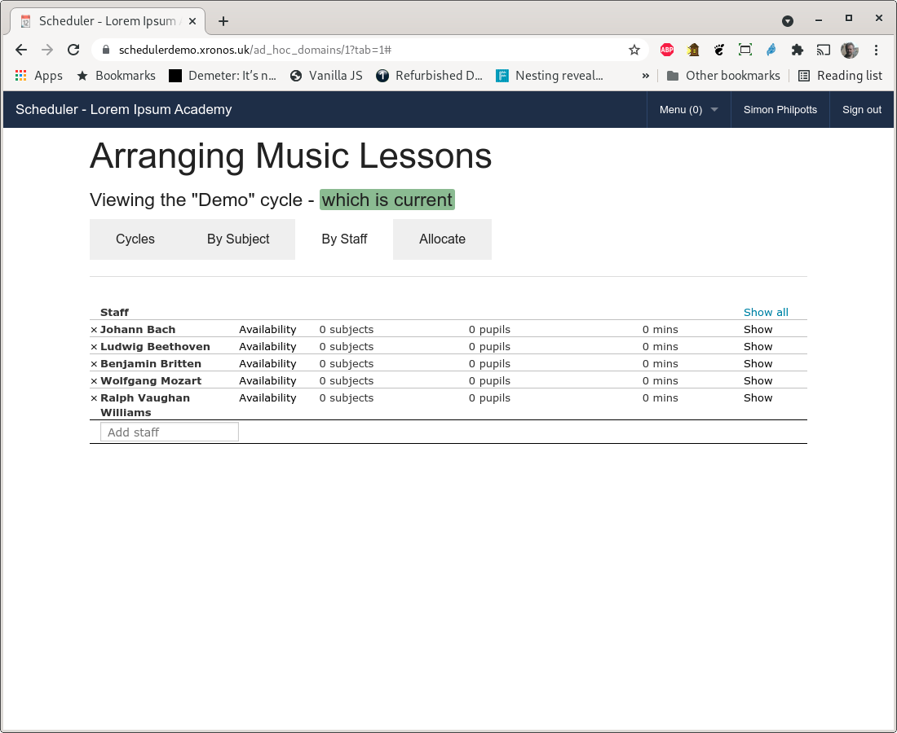

Ad Hoc Lessons
==============

Purpose
-------

Scheduler uses the term "Ad Hoc Lessons" to refer to lessons where pupils
are taken out of their normal timetabled lesson for some kind of extra
tuition.  Typically this will be an instrumental music lesson, learning
support or something similar.

It is generally desirable to rotate these kinds of lessons so pupils
don't miss the same subject more often than is necessary.  If, for instance,
an instrumental music lesson makes a pupil miss a maths lesson one week,
then the same pupil should not miss another maths lesson the following
week.

The person responsible for scheduling these Ad Hoc lessons therefore
needs access to all the pupils' individual timetables, plus a record
of what lessons they have already missed.  Scheduler aims to assist with
this by providing all the relevant information in one place.

Once a suitable schedule for the term (or half term, or whatever period
you choose) has been devised it can be published automatically to both
pupils and relevant teachers.

Pre-configuration
-----------------

Initial configuration of an Ad Hoc category will be done by your system
administrator who will also appoint one or more controllers for the
category.  This guide assumes you have been appointed as a controller of
an Ad Hoc category for the scheduling of peripatetic music lessons.

You can change most things about the category but a couple of them will
require intervention by your system administrator because they are global
items within the system.

* The overall day shape - what hours there are in the morning and afternoon -
  is set by your administrator.  You can then define more specific
  availabilities for each of your music teachers.
* The list of subjects potentially available - e.g. Viola, Violin, Mandolin -
  is again set by the system administrator.

If you are the system administrator and want to set up an Ad Hoc category,
then see the `Scheduler Admin Guide <https://xronos.uk/admin/adhoc.html>`_

Once the system administrator has created the Ad Hoc category, you will
find you can access it through Menu => Ad Hoc t/ts => Music Lessons.

You can work through all of the following on the
`Scheduler Demo System <https://schedulerdemo.xronos.uk/>`_ by logging
in as Simon Philpotts (SJP).

Overview
--------

In order to use the Ad Hoc lessons facility, you will need to think
about a number of things to set up.  Most of this needs to be done
only once - the first time you use it - and then can be carried forward
into subsequent uses.

* Cycles - a cycle is a period of time in which you schedule lessons. It
  will be whatever unit you usually use - typically a term or half a
  term.

* Subjects - the subjects being taught in your Ad Hoc lessons.

* Staff - the people doing the teaching.  These will generally have been
  imported automatically from your MIS.

* Pupils - pupils are entered linked to a subject and a member of staff,
  creating a requirement for a lesson.

* Allocations - for each cycle you can create one or more allocations.  These
  are attempts to schedule the required lessons satisfactorily.  You can
  have more than one because you might want to try different allocations
  until you find one you like.

* Implementation - once you are happy with an allocation, you can implement
  it.  This has the effect of publishing the lessons you have scheduled and
  injecting them into the schedules of both staff and pupils.  If you later
  decide to implement a different allocation, all the lessons created by
  the first one will be removed and the new ones will be put in their
  place.

.. note::

   If you have implemented an Allocation and later decide you want to
   remove all the lessons again, simply create a new blank Allocation for
   the same Cycle and implement that one.  Doing that will delete all the
   lessons from the first Allocation (from the published schedule - not
   from the Allocation itself) and not create any replacement ones.

Cycles
------

A cycle is whatever period of time you want to do your scheduling over,
typically a half term or a whole term.

The first cycle which you set up is the most laborious because you need to
enter all the subjects, staff and pupils for it.  For subsequent cycles
you can choose to copy over information from a previous one.

Thus, having set up a cycle for the first half of a term, you would probably
want to copy over everything - subjects, staff and pupils - into the
cycle for the second half of term, making any required changes manually
afterwards.

On the other hand, at the start of a new academic year, you would probably
copy over just subjects and staff, and enter all the new pupils afresh.

Assuming your system administrator has set you up as a controller for
your Ad Hoc category, you should find you have an extra menu item like
this:

Click on the "Music Lessons" menu item and you will see a screen like
this.

Currently there are no Cycles defined so click on the "New cycle"
button and fill in the fields.

.. note::

   If you are working through this example on the
   `Scheduler Demo System <https://schedulerdemo.xronos.uk/>`_ then
   as dates use the start date of your current week and the end date of
   the following week.  The data in the demonstration system are regenerated
   every night and roll through the year, always appearing in whatever is
   the current week.

We can't select anything in the "Based on" field because this is our
first Cycle.  If we were doing the second half of a term then this is
where we would select a Cycle on which to base our new Cycle, and specify
how much of the previous one was to be carried over.

Note that the above cycle is currently flagged as "Not current".  Because
you can have many cycles in existence at once, Scheduler has the concept
of a "current" one, which simply means the one which it will assume you
want by default.  Click on the "Set as" button next to the name of the
cycle to make it the current one.

The cycle is now flagged as current and our view has been moved on to the
second tab of the page, headed "By Subject".
You can always go back to the first tab - Cycles - to choose to
work with a different cycle.

Subjects
--------

Next we enter in the subjects which are due to be taught in this cycle.
The necessary global subject records must already exist in the Scheduler
system, but we're now linking them to staff and pupils.  Simply type
the name of a subject in the "Add subject" field and press Enter.
Continuing doing this until all your subjects are listed.

The list can get a bit long for the screen so buttons are provided to
fold the display.  Click on "Hide all" to reduce it.

Staff
-----

Click on the next tab - "By Staff" to start entering staff information.

.. note::

   It's entirely up to you whether you enter subjects and then staff,
   or staff and then subjects.  You can also then link them together by
   entering a staff member name under a subject heading, or by entering
   a subject name under a staff member's heading.  Whatever is easier
   for you - it all ends up in the same place.  You can switch backwards
   and forwards between the two tabs and you will find all the information
   entered on one is visible on the other.

Enter the names of staff who are going to teach your Ad Hoc lessons in
exactly the same way as you did for subjects.

For the purpose of this example, we will have just J.S. Bach teaching
Violin and Ludwig van Beethoven teaching Viola.

Although I have entered the subjects under the staff headings, if we
flip back to the "By Subject" tab we find exactly the same information
there.

Availability
^^^^^^^^^^^^

Each staff member will typically have certain defined periods of time
when they are available to teach.  This information can be entered
from the "By Staff" tab by clicking on the "Availability" link next
to the staff member's name.

The background periods shown on this screen were defined by your
system administrator when the Ad Hoc category was set up.  They
should reflect the normal times when teachers would be available.

In our case, JSB teaches all day on Monday, plus Tuesday morning until
11am.

Click on the background periods for each of these slots to create
an availability schedule for JSB.  Then drag the end of the Tuesday
morning one to 11 o'clock.

To delete a slot entered in error, just click on it again.

Pupils
------

Enter pupils on either of those two tabs under the staff and subjects
where they are due to have lessons.  The lesson duration defaults to
the number of minutes which were set when the Ad Hoc category was
created but you can increase or decrease the duration as required.

If a pupil has been entered with the wrong duration of lesson, just
click on the number of minutes and you can change it.

Allocation
----------

Will all the above information entered, you can now think about doing
some actual scheduling.

It is assumed that you might want to have more than one go at this for
a given cycle to try to find the best fit (fewest academic lessons missed).
For that reason you can create more than one Allocation within a Cycle
and then decide later which one you like best.

Click on the "Allocate" tab to see a list of your allocations - currently
empty.

Click on the "New allocation" button and the only information which you
need to give is a name to identify it.

Then click on your new allocation's "Edit" button to start placing lessons.

Click on JSB's "Allocate" button and you should get a screen much like
this:

This is one of the more complex screens with quite a bit to take in.

On the right we have a calendar showing the first week of the cycle
and with JSB's availability shown by means of background periods.  There
is also an existing event involving JSB (entered through Scheduler's
normal event editing facilities) which means he isn't available for
teaching for part of Tuesday morning.

On the left we have one cell for each of the pupils needing a lesson
scheduled.  Above that there are some buttons for saving your work
and exiting the screen, plus a switch for turning on and off assisted
placement.

.. warning::

   All your allocation work is done locally within your web browser.
   You need to save your work back to the server if you want to keep it.

If you have assisted placement turned on then the program will position
each lesson intelligently within the availability slot to which you have
dragged it, avoiding gaps between lessons etc.  If you turn it off then
each lesson will simply be placed exactly where you put it.

What you need to know when scheduling lessons for individual pupils is
the individual academic timetable for each pupil, plus how often they
have already missed particular subjects.  If you click on Peter Elliott's
cell on the left hand side, his timetable will appear in the schedule
on the right.

All the lessons are green indicating that he has not yet missed any
lessons in those subjects.  Drag the blue "Drag me" box from Peter's
cell on the left onto the Monday morning area and it will be positioned
automatically at the start of that slot.

Note that all Peter's German lessons have now changed colour because
he has missed at least part of a German lesson in this cycle.

Continue by dragging lessons for other students onto the schedule.
At any time you can change whose timetable is showing by clicking either
on the student's cell on the left, or on an already placed music lesson.
You can remove timetables entirely by clicking on the "Clear timetable"
button under the student cells.

On the above screen, most of the week's lessons have been scheduled and
we've gone back to looking at Peter Elliott's timetable.  Note that his
music lesson is in pale blue, whilst all the other students' lessons are
in grey.  This enables you to tell quickly which music lesson relates
to the timetable currently being displayed.

If you now click on James Greenwood's cell on the left, another little
nuance appears.

His timetable has appeared as expected, but also another music lesson.
This is because he studies Viola as well, and his Viola lesson for this
week has already been scheduled within this allocation.  It appears
here because obviously he can't have both his lessons at the same time.
The colour of his English lessons has also been changed to indicate that
he has missed an English lesson, even though it wasn't for the Violin
lessons which we are currently considering.

First thing on Tuesday looks like a good time for his Violin lesson
so we can put it there.

Note that, whilst Scheduler will attempt to assist you in placing lessons,
you can always override it and go for something apparently less than sensible.
You could drag that freshly placed lesson and put it in the middle of
James's English lesson on Wednesday morning, despite JSB not being
apparently available then, and it being a lesson which James has already
missed one of.

Note that the English lessons have moved further from green towards red because
James is now missing two of them.  If we move on to the next week and again
deliberately put James's lesson in an English lesson it gets even worse.

When you're happy with what you've done, click on "Save & exit" and you're
taken back to the list of staff to be allocated.  Note the indication of
how much more you have to do.

At any time, you can clone an Allocation and do further work on the clone.
This can be useful to try out "what if?" scenarios.

Implementation
--------------

Once you have an Allocation with which you are happy you can publish it
by clicking on the "Implement" button on the listing of allocations.

Doing this will cause all the lessons in the allocation to be created
in Scheduler's main event database, making them visible to staff and pupils
alike.  They will supersede any events created by a previous allocation
within this cycle.  (Any other events with the same Event Source, as
configured when the Ad Hoc category was set up.)
