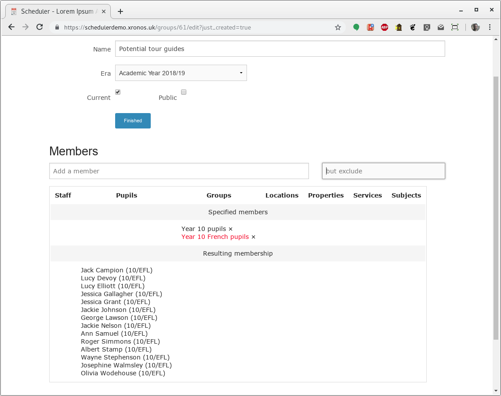
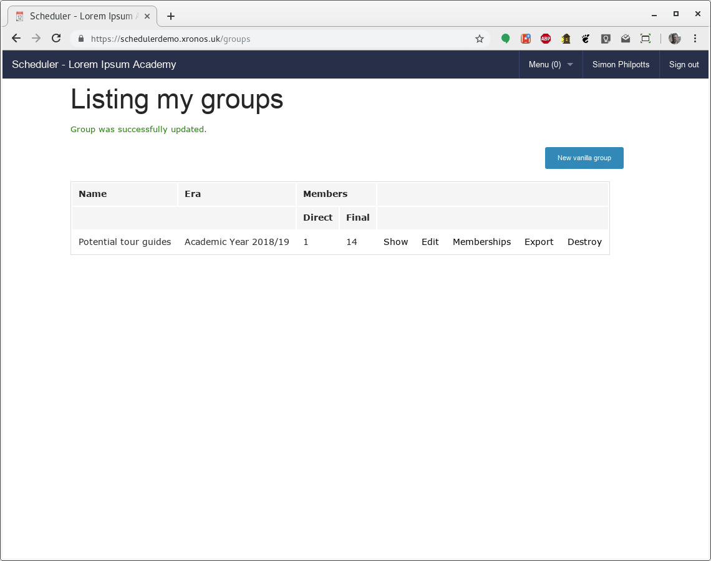
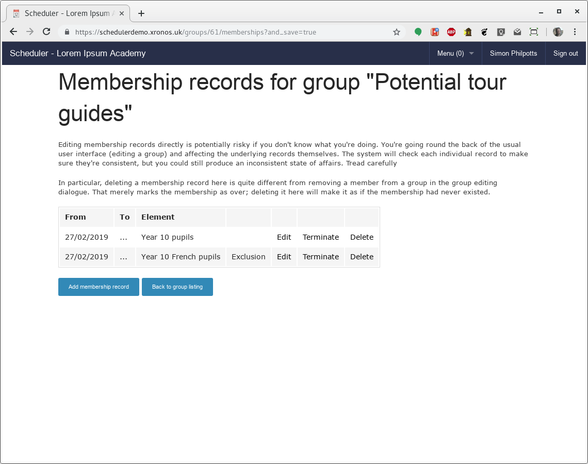
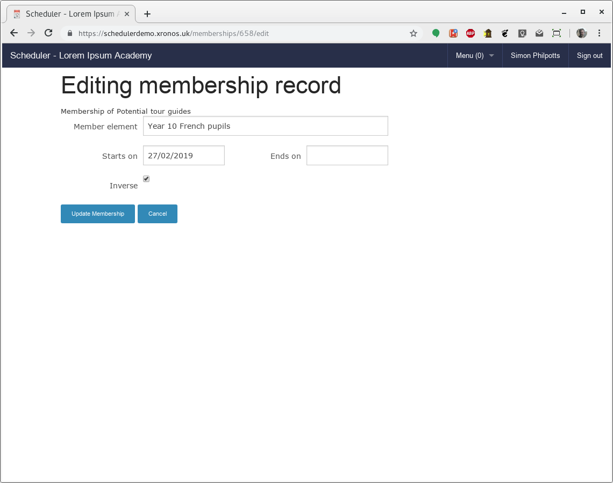
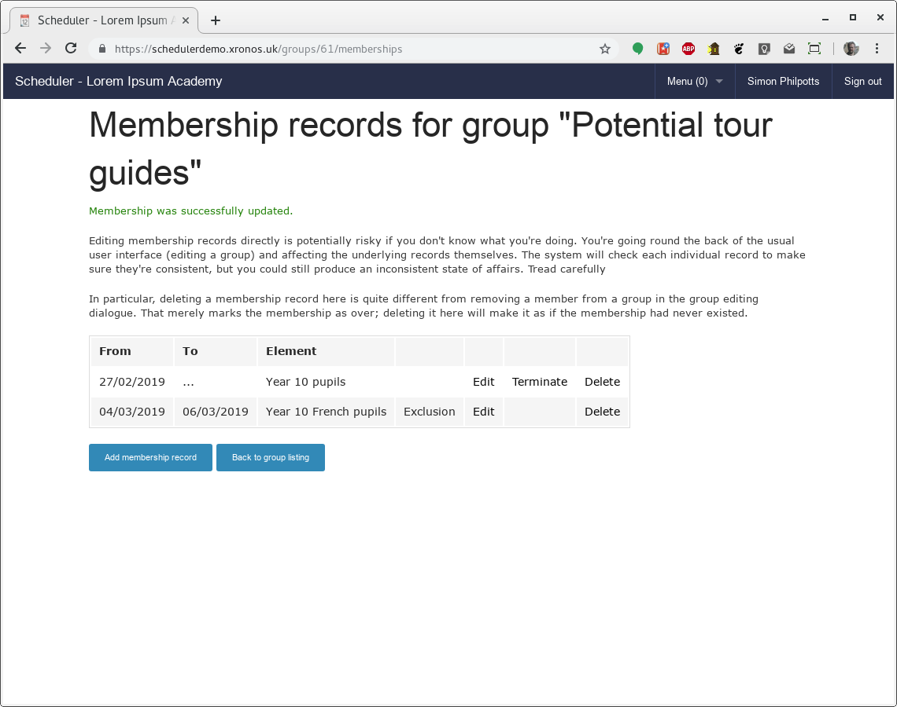

Advanced group editing
======================

--------
Overview
--------

Scheduler differs from most school information management systems in
that it understands the chronology of groups - whether they are teaching
groups, form groups, or any other kind of group.  Rather than just telling
you what the membership of a group is now, Scheduler can tell you what it
was at any date back to the group's creation, or if appropriate what
it will be in the future.

Scheduler's display of events is fully integrated with this idea of
groups where the membership varies over time.  Thus you can, for instance,
change the members of a football team from week to week, but viewing
past matches for the team will still show the correct team for each
individual date.

This level of control is potentially confusing for a naive user and so
the basic form of group editing (as described in the
`Xronos Scheduler User Guide <https://xronos.uk/groups.html>`_)
hides it.  When editing a group as described there, adding a member is taken
to mean "Add this member from today's date forward", and removing a member
is taken as meaning "Terminate this membership as of the end of yesterday".

.. note::

  If you add and then remove a member on the same day, the effect is to
  delete the membership entirely.  This is the only case where the simple
  group editing dialogue actually deletes a membership record.

This simple way of editing a group's membership is easy to understand,
and slightly hides the fact that the system is keeping track of all the
changes to the membership over time.

Sometimes however it is desirable to have a bit more control - to add
a member to a group in advance, or for a known period (just one week perhaps),
or to adjust a historical entry which is wrong.  This is where advanced
group editing becomes useful.

----------------
Database records
----------------

To use the advanced group editing feature, it is necessary to understand
a little of how the groups are stored in the database.

Each group has one **Group** record, and then zero or more **Membership**
records.  Each of these has a start date, and optionally an end date.

The **Group** record holds the name of the group, whilst each **Membership**
record links one member into the group.

The start date in the **Group** record is the date from which the group
is to be considered as existing, whilst the start date in a **Membership**
record is the date from which an individual membership runs.  If a
**Membership** record has a start date earlier than that of its parent
**Group** then it will be treated as if it had the same start date as the
**Group**.

If either type of record has no end date then it is considered as going
on forever.  Otherwise the end date records when the group or membership
ended.

.. warning::

  The end dates are *inclusive*.  That is, if a **Membership** has a
  start date of 21/2/2019 and an end date of 23/2/2019, then the
  member was a member of the group for three days - the 21st, 22nd and 23rd
  of February.  This is slightly illogical from the programming point of
  view, but perhaps easier for the casual user to understand.

Two or more **Membership** records can exist linking a single item
into a group, but not if they overlap chronologically.  Thus a pupil
could be a member of a football team from the 1st to the 20th of January,
and then again from the 19th of February to the 3rd of March.  Any
attempt to create two chronologically overlapping **Membership** records
specifying the same member and the same group will be rejected by the
low-level validation code.

**Membership** records can also specify *exclusions* from a group. These
are used to exclude individuals who would otherwise be a member of
the group, and are most useful when handling nested groups.  One might
want a group of all the sixth formers who are not prefects.  This can
be achieved by creating a **Group** record, adding one **Membership** record
to nest the group of sixth form pupils, and then a second **Membership**
record with the inverse flag set.  The system will then calculate who
is left and treat that as the list of members of the group.

-----------
Permissions
-----------

Because it is possible to achieve confusing effects by perverse use of
these features, the ability to do direct editing of **Membership** records
is not open to all users.  There is a special permission bit which
needs to be set by a system administrator before an individual user can
access the editing facilities described here.

--------------
Actual editing
--------------

As an example of using the facility, consider the need to set up a
group of all the pupils in year 10 who would be available to act as
tour guides.  The pupils who study French are off on a trip, and so
won't be available for at least some of the time.

Using the standard group editing facilities, (as described in
`Xronos Scheduler User Guide <https://xronos.uk/groups.html>`_)
it is easy to create an initial group.  This group specifies that it is
to contain all the year 10 pupils, but not those who study French.

However, perhaps the French trip is away only for a few days?  If
we know those dates we can edit the group more precisely using the
advanced editing facilities.

By clicking on the "Finished" button we can go back to the group
listing, and note there the additional "Memberships" link.

Clicking on that brings us to a listing of the actual **Membership**
records which record the group's members.

There are two **Membership** records listed, both of which start on
the 27th of February and have no end date.  One causes the inclusion
of all the year 10 pupils, whilst the other is an *exclusion* (note
the word "Exclusion" in one column) and causes the French pupils
to be excluded.

However, perhaps the French trip is away only from the 4th to the 6th
of March.  We can edit that second **Membership** record to include
that information.  Click on the "Edit" link for that record and we
get a dialogue like this:

Click in the date fields and you get the usual date dialogue.  We
can change the start and end dates to match the actual dates of the
trip.

And then save the modified record, giving us a listing like this.

The group could now be used in conjunction with, for instance, the
"Find free" dialogue to find free tour guides on any given day.  The
system would use the appropriate membership on each chosen day, automatically
avoiding the use of the French pupils on the three days when they are
absent.

--------------------------
Invalid membership records
--------------------------

Each time you try to save a membership record, the system will perform
some basic validation on it.  The following errors will cause your
update to be rejected.

- No member specified

- No start date specified

- Dates back to front

  The "Ends on" date can't be before the "Starts on" date

- Record not unique

  You can't create two **Membership** records for the same group and
  member whose date's overlap.

- A group can't be a member of itself

  You can't create a **Membership** record which makes a group a direct
  member of itself.

.. note::

  Although you can't make a group a direct member of itself, you can
  create a loop - A is a member of B is a member of C is a member of A.
  You can even make some of the **Membership** records in that chain
  be exclusion records.  There's no mileage in it however - the group
  processing code simply stops following the chain when it hits a group
  which it has seen before.
