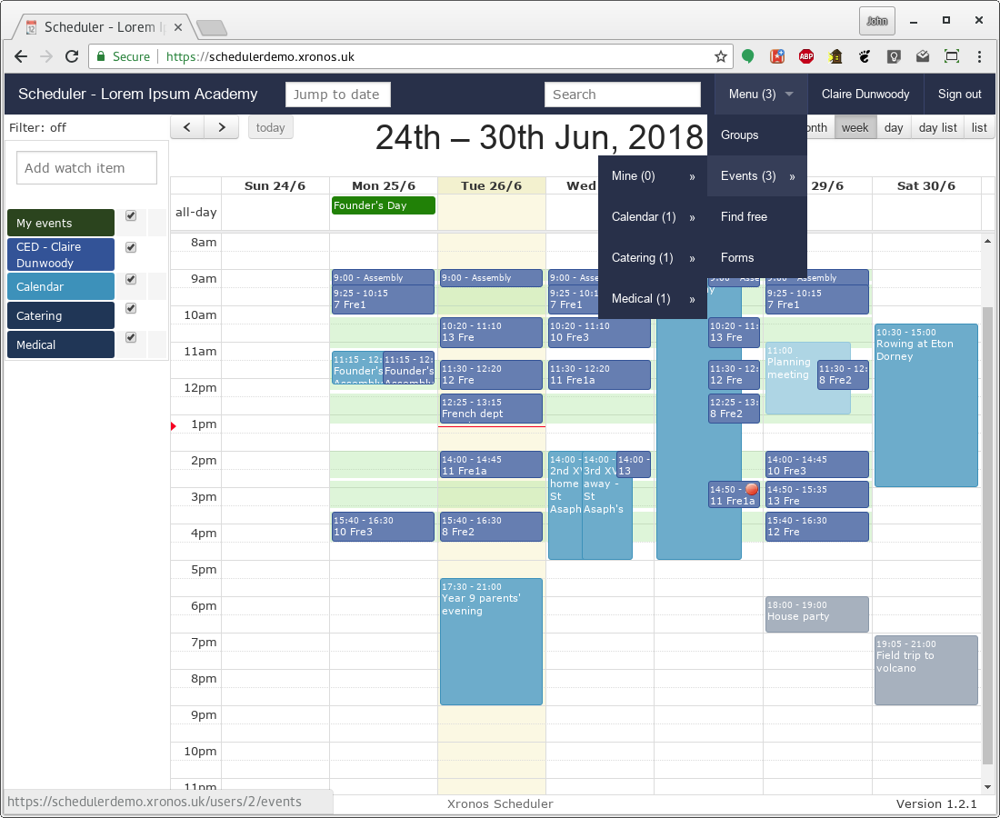
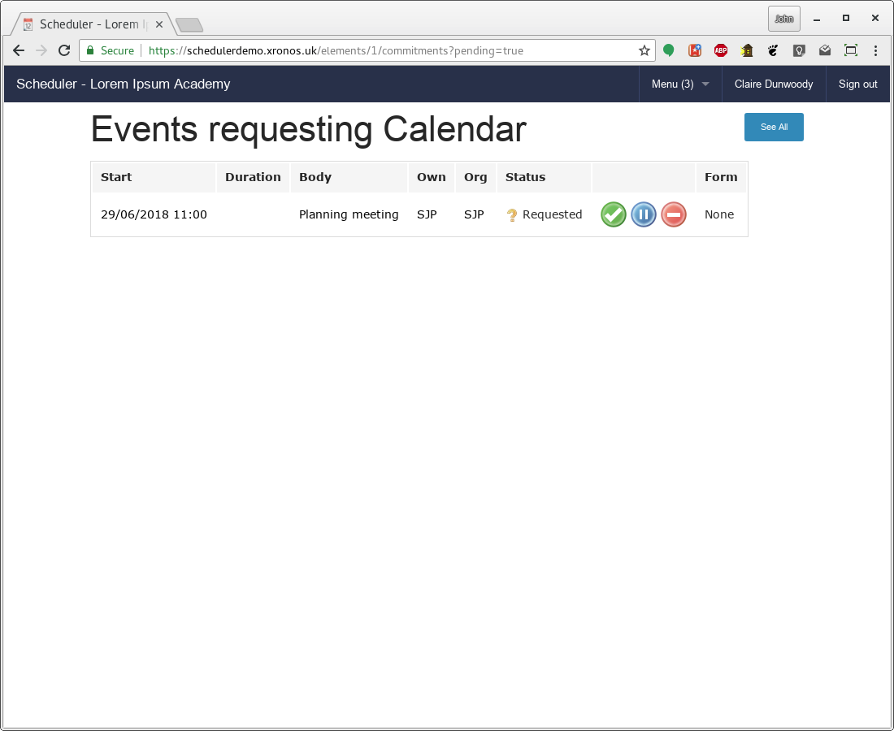
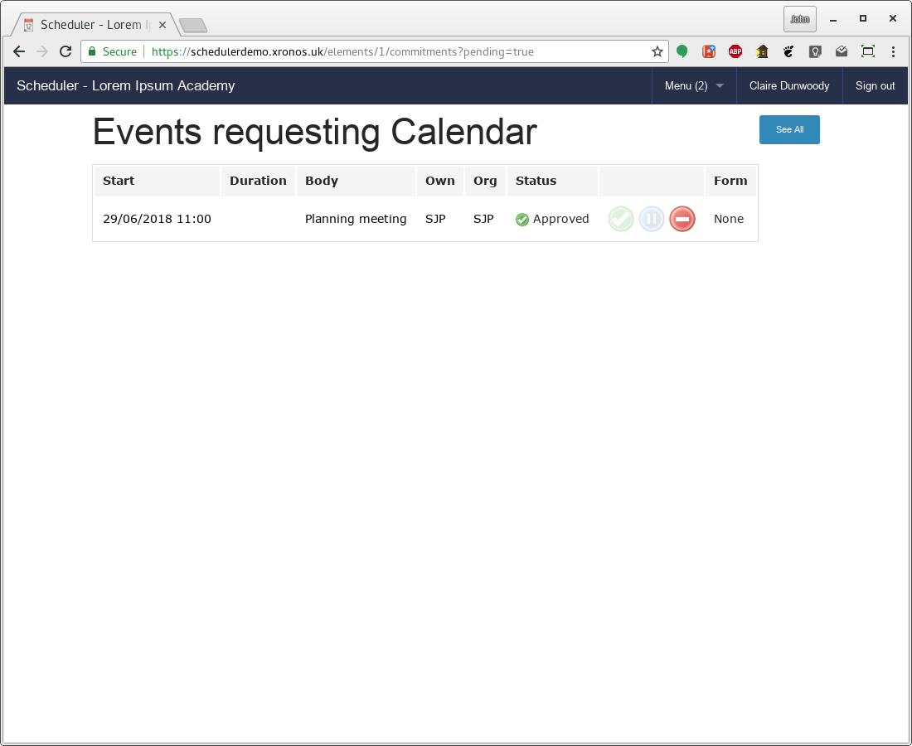
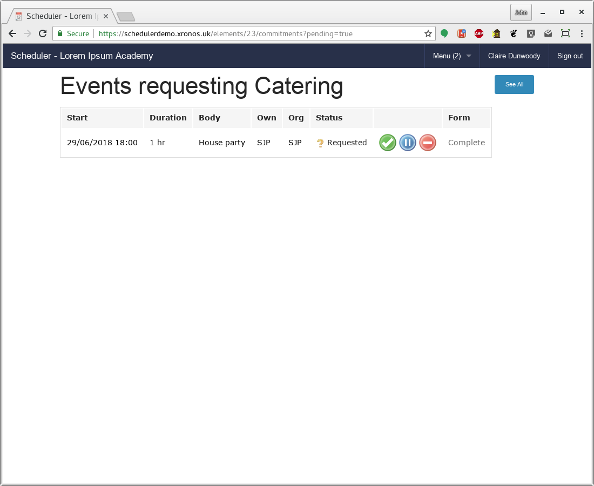
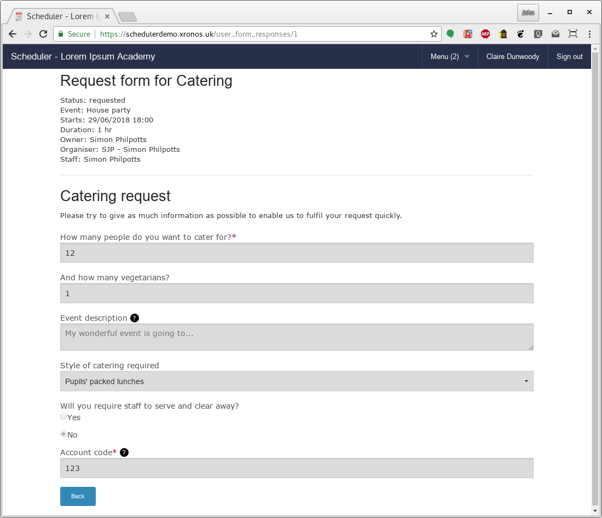
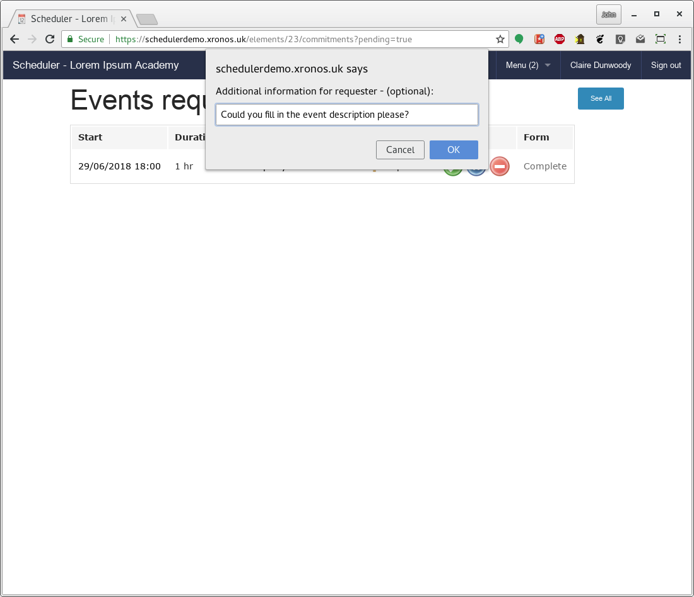
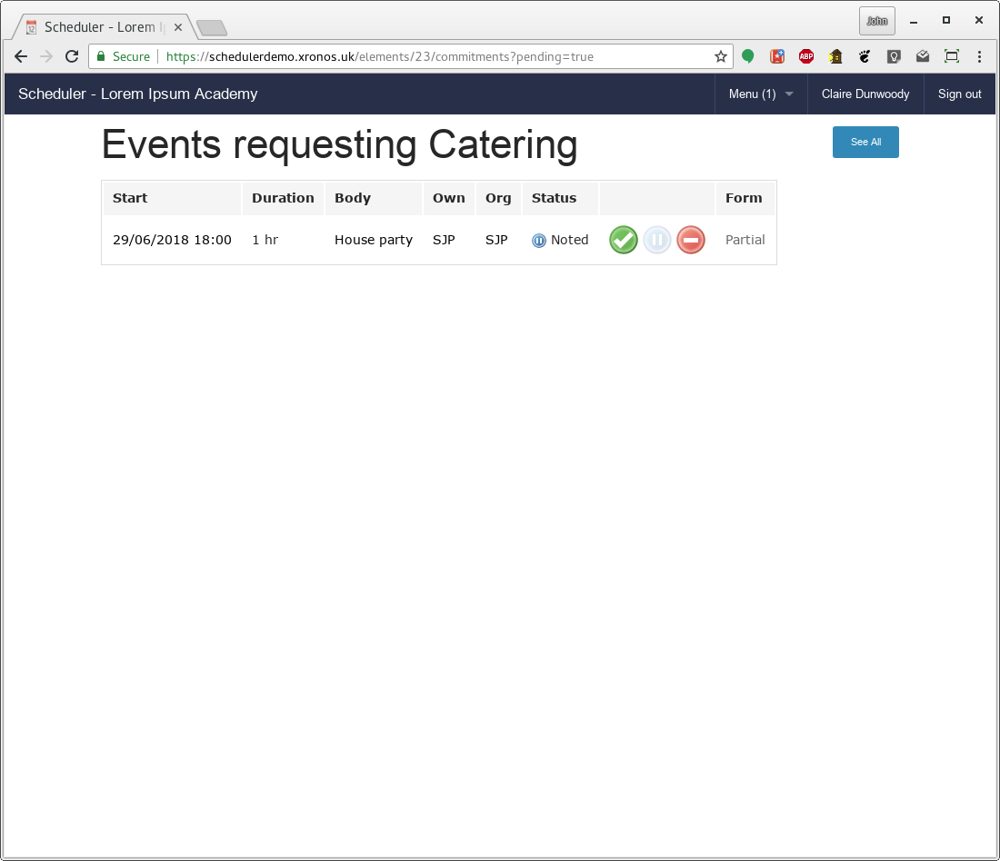

.. _event_approvals:

Event approvals
===============

Perhaps a slight misnomer - it's not the events themselves which need
approval, it's the events' use of resources.  What gets approved
is the use of a resource for an event.  Where the resource is a special
property (like "Public calendar") that approval then causes the event
to appear in the public calendar.

The current user (Claire Dunwoody) has 3 items awaiting
her attention, meaning she has a "(3)" against her menu, and popping
down the menu makes it clear where each of these items is - one for
the public calendar, one for catering, and one for medical.  (These
screenshots follow on directly from the documentation about creating
events in the basic user guide.)

---------------
Simple approval
---------------

Of the waiting items, the request for an entry in the public calendar
is the simplest.  Clicking on that menu item produces a listing like
this:

There is no form associated with this request, and there are three
buttons available to process the request.  The green tick means "Approve",
The blue pause button means "Noted", whilst the red no-entry sign
is for rejection.

If all is well, the event can simply be approved.

If there is a problem with the proposed event, it can be rejected.
Clicking the reject button results in a small dialogue box requesting
a reason for the rejection.  This will be e-mailed to requester and
attached to the event.

The "Noted" button exists for when approval can't be given just yet -
either because more information is needed or it's just too soon to be
able to say - but the approver wants to make it clear that the request
has been seen.

A typical scenario where a status of "Noted" makes sense is when someone
wants, for instance, some catering but doesn't know the full details
yet.  The catering department will want to know about the proposed event
as early as possible, but may not be able to give final agreement until
the numbers are known.  An early request without full details gives
the catering department a heads-up that it's going to happen, and they
can use the "Noted" button to put it into a state of suspension.  Then
when the requester fills in the rest of the information they can give
their final approval.

For this request, if we click the green tick it goes into a state
of "Approved", and the user's count of pending items goes down to (2).

-----------------
Request with form
-----------------

Some resources - like catering - have a form attached.  Clicking
Menu => Events => Catering brings us to this screen:

The word "Complete" in the final column is a link, and clicking on it
allows the form to be viewed.

Let's assume that approval can't be given yet because of the lack of
an event description.  Clicking "Back" to go back to the listing and
then the blue button produces a small dialogue.

and then the request moves into a state of "Noted".

The user's count of items awaiting attention has now gone down to (1).
As far as this request is concerned, the ball is back in the requester's
court.  When the requester amends the form, it will come back to the
approver.

