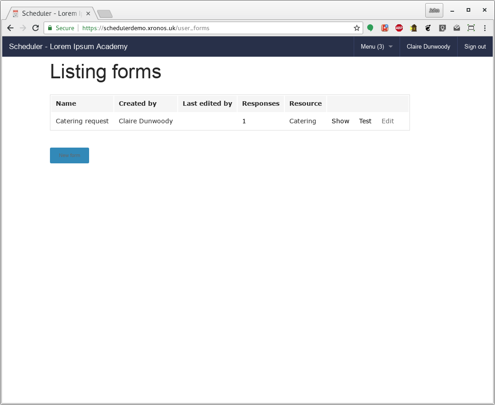
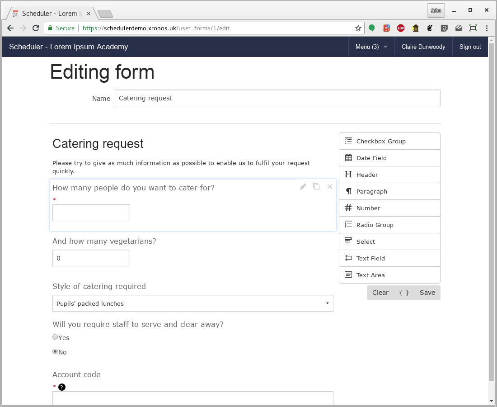
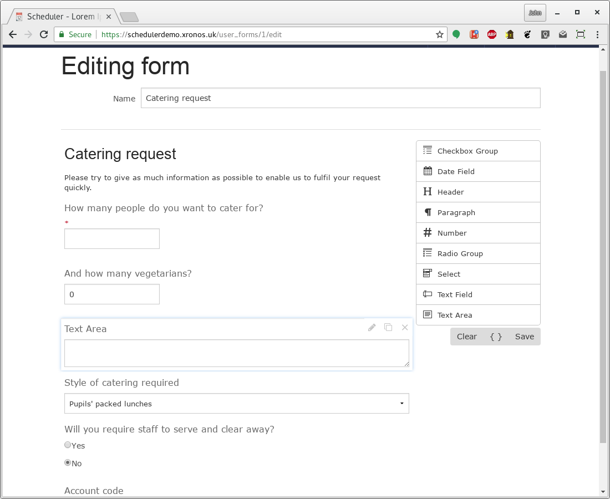
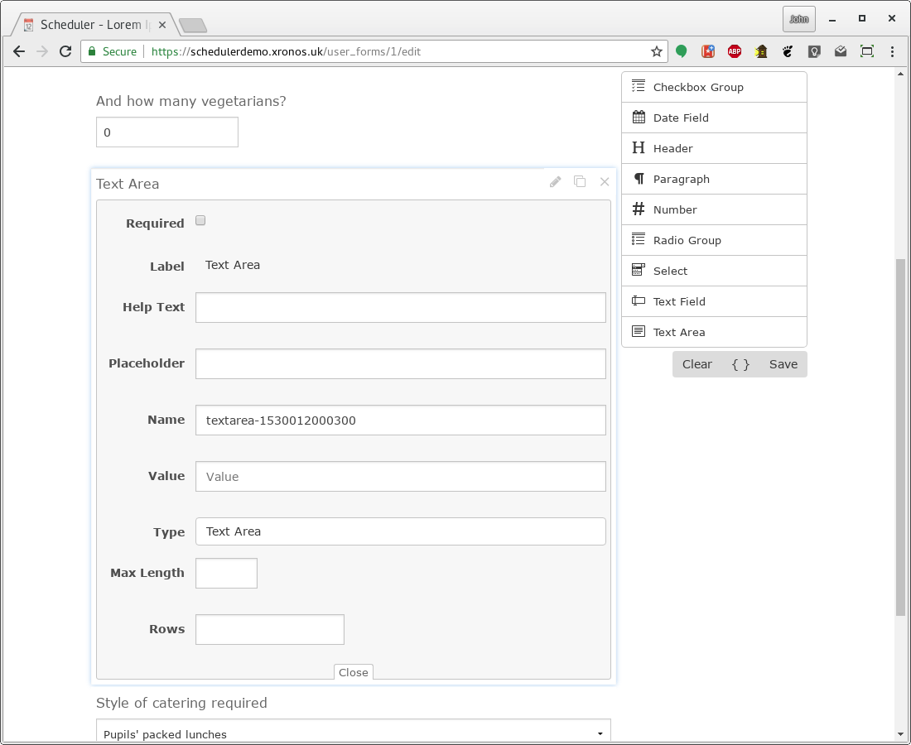
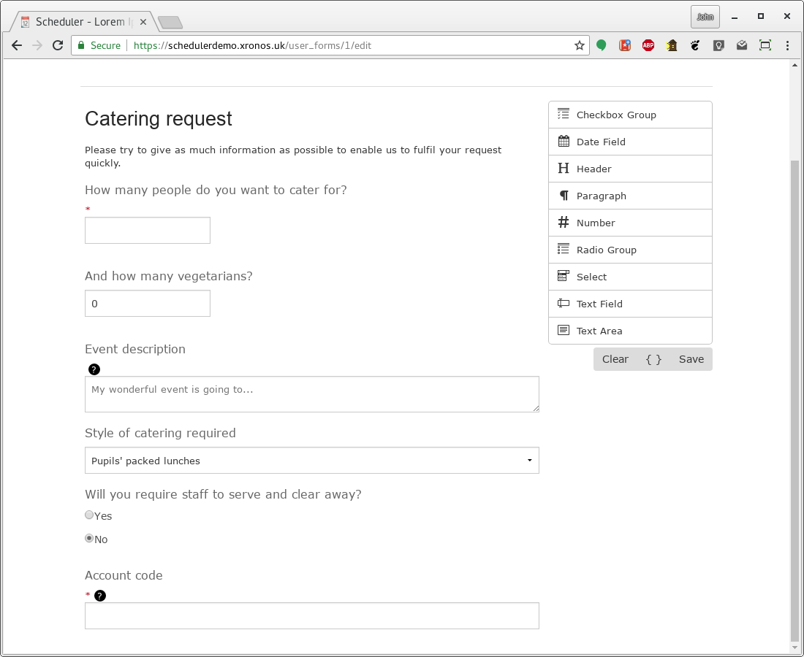
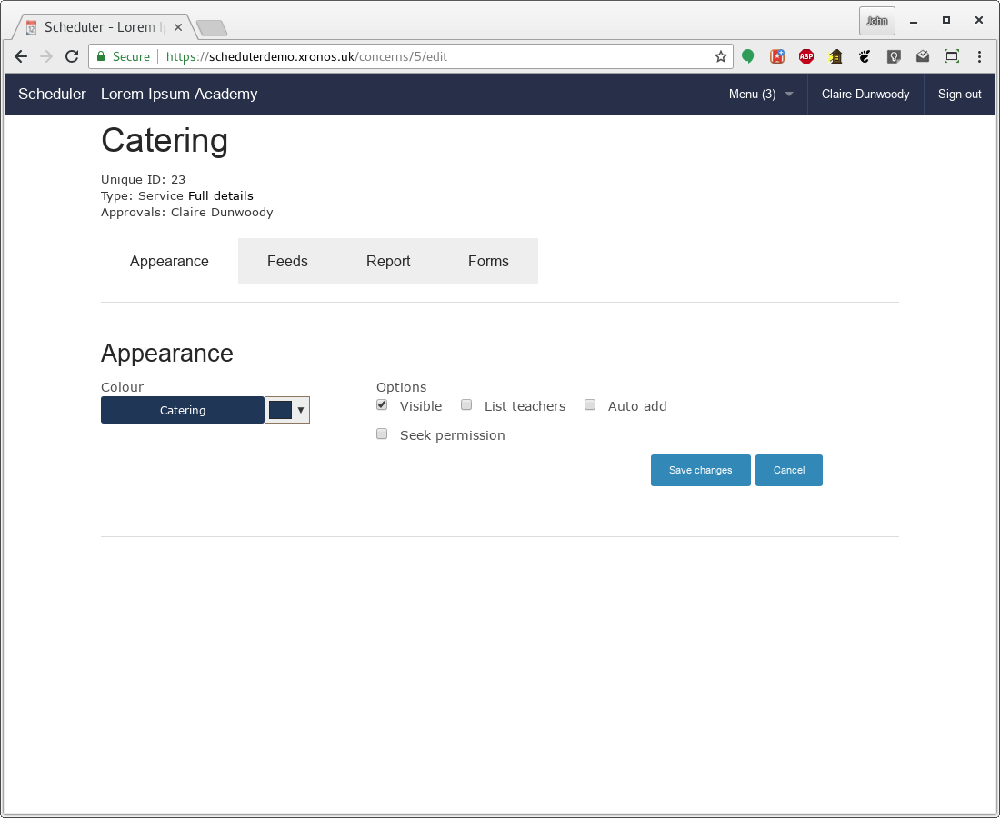
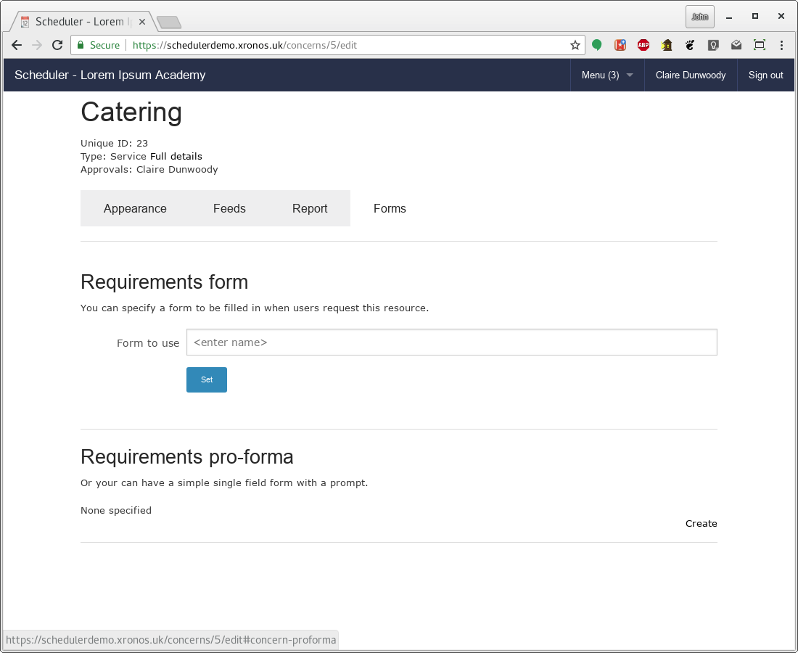
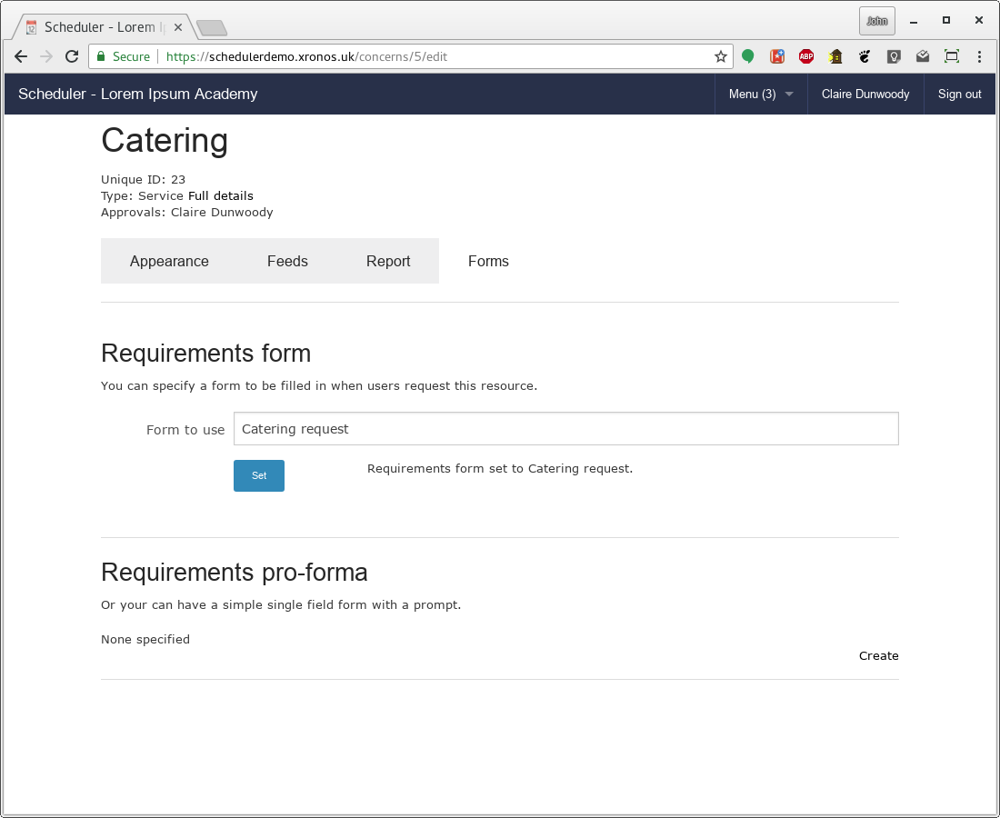

Editing forms
=============

--------
Overview
--------

If you control a resource within Scheduler, it is likely that your
system administrator will have given you the ability to create and
edit forms.  These allow you to gather more information about what
the end user requires from your resource.

A typical example of this would be the catering department gathering
more information about the exact type and quantity of catering
required for an event.

Note that there is a single pool of forms within the system - they do
not belong to individual users.  If you have form editing permission
you will therefore be able to edit any of them.  Changing one in use
by another department will probably not be a good idea.

Forms can potentially be used by more than one resource.  The workflow
is first to create the form, then attach it to whichever resource(s) need
it.

-------
Listing
-------

To list the forms in the system (assuming you have the necessary
permission) choose Menu => Forms from the top menu bar.  You will
see a screen something like this:

The form listed here is created by default in the demonstration
system and is the one used to document forms in the basic user
guide.

-------
Editing
-------

To edit this existing form, click on the "Edit" button to the right
of its listing entry and you'll get a screen like this:

The name of the form is given in the field at the top, and then
everything below that provides a drag-and-drop interface for adding
or removing fields.

.. warning::

   If you remove a field from a form which has already been used
   (that is - one which has had copies filled in by users) then
   the contents of that field for each of the existing responses
   will become effectively unavailable.

On the right you have a list of the kinds of fields which are available.
To create one, simply drag it onto the main body of the form at the
place where you want the field to be.

Let's say we want to provide a field for the user to give a general
description of their event.  Drag the "Text area" item from the right
to just above the "Style of catering" field and we have:

The default name of "Text area" isn't terribly helpful, but you can
click on the little pen icon and adjust various properties of the
field.

If you click on the label ("Text area") you can change it, and likewise
you can provide help text, placeholder text and default contents.

The Name is particularly important.  Provided you leave this alone you
can change any other aspect of the field and the system will recognize
it as being the same field.  If you change the Name, then it will become
a different field, causing problems with any existing responses held
within the system.

When you've finished tweaking the field, click on "Close" at the bottom
of the box and it will collapse back to being just a field.  I've called
it "Event description" and given it some help text (which causes the
black question mark) and some placeholder text.

When you've finished setting up your form the way you want, click
"Save" on the right hand side and you'll be taken back to the listing.

--------
Creating
--------

To create a new form, click on the "New form" button in the forms
listing, give it a name, and then proceeed as for editing above.

------------------
Attach to resource
------------------

.. note::

   You don't need to have form editing permission to be able to
   attach a form to your resource - you just need to be a controller
   of the resource.

   Likewise, you could have form editing permission, but not be the
   controller for any resource, in which case you can create forms
   but not attach them.

   All this is under the control of your system administrator.

Once created, the form can be attached to a resource which you control.
To do this, click on the name of the resource on the left hand side
in your main calendar display and you'll get a screen like this:

This is the normal screen for seeing more about a resource, but because
the current user is a controller of the resource there's an extra
tab - "Forms".  Click on the Forms tab and you'll see:

The field labelled "Form to use" is the usual kind of predictive
text field.  Just start typing the name of the form which you want,
select it, and then click the "Set" button.

In this case, the form for the resource has been set to be the one
called "Catering request".

Once a form is attached to the resource, all users requesting the
resource will be required to fill in the form.

----------------
View and approve
----------------

Once forms have been set up and then filled in, the viewing of them
fits in to the rest of the
:ref:`event_approvals` procedure.

