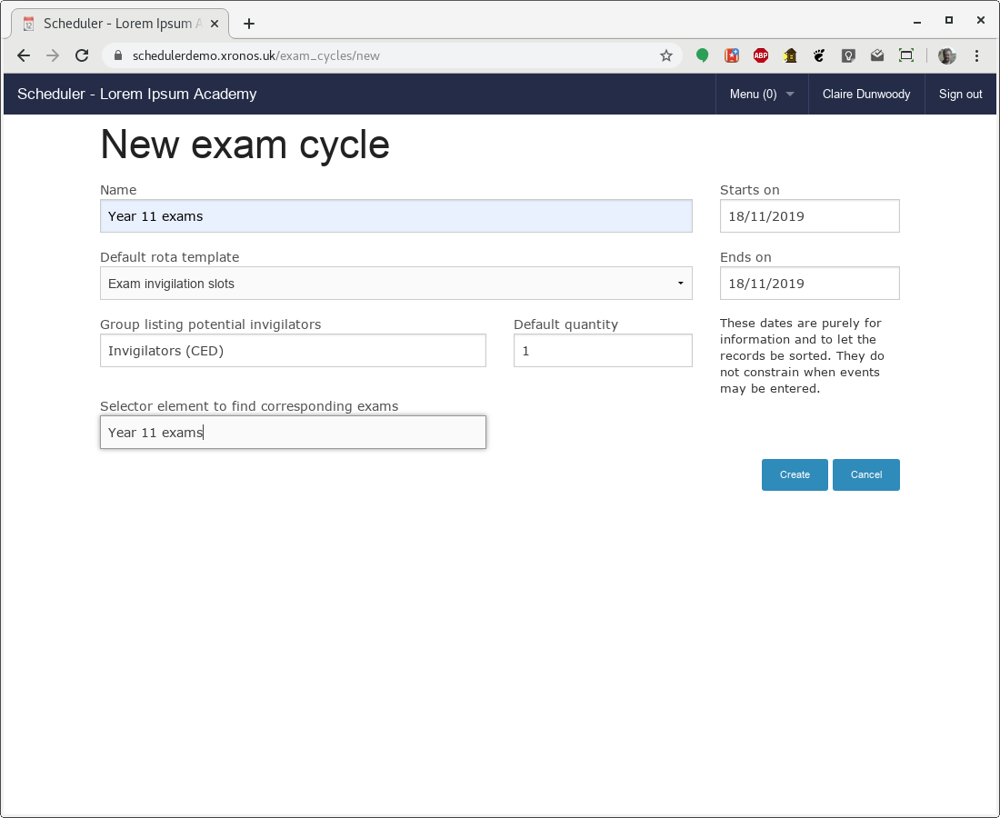

Exam invigilation
=================

Overview
---------

Some School Management Information Systems are better than others at
handling the entry and maintenance of exam invigilation slots.  If
your MIS has the facility to handle these then Scheduler will import
and display them, but if not then you can do it directly with Scheduler.

Scheduler will assist you with setting up the framework of slots, scheduling
when the actual exams are, and selecting the most suitable staff to use
for each individual slot, taking into account suspended lessons
and how many slots each staff member has already done.

Scheduler aims to help with the process of converting a general statement
about when and where exams will be into a set of individual invigilation
slots.

.. note::

   Scheduler uses the following terms:

   - **Exam Cycle** - a set of exams like "3rd year summer 2019 exams",
     or "January re-sits 2016".

   - **Exam Session** - a continuous period of time when exams are in
     progress.  Typically an Exam Cycle will have several (possibly many)
     Exam Sessions.  Each Exam Session has a start and end time, and covers
     not just the actual duration of the exam(s), but also the setup
     and clear up times.  An example might be "Wed 8th June, 08:45 - 12:30".

   - **Exam/Invigilation Slot** - a period of time within an Exam Session
     which is allocated to one or more individuals to invigilate.  The
     duration of your Slots will typically be driven by your school's
     normal timetable.

In setting up an Exam Cycle in Scheduler it is assumed that someone has
already decided when the exams will happen and what rooms they will use.
We enter that information into Scheduler, and then along with what it
already knows about your school day it can generate all the necessary
Exam Slots.  Given a list of the staff who may do invigilation, it will
also assist you with allocating individual staff to each Slot.

.. note::

  All the screen shots below are taken from the
  `Scheduler demonstration system <https://schedulerdemo.xronos.uk/>`_.
  You can work through all the stages yourself by logging in as CED
  from the pull-down login menu.  Claire Dunwoody (CED) is designated
  as the exams officer on this system.  You will see some differences
  in staff names because most of the staff are randomly generated
  each night, but the general flow remains the same.

  It is assumed that you already know the basics of how to create
  events within Scheduler - if not then see the
  `Scheduler User Guide <https://xronos.uk/events.html>`_.

General setup - done only once
------------------------------

The next three items need be done only once, then the same data will persist
across all your Exam Cycles with only minimum changes.

Who can invigilate?
-------------------

Assuming your normal teaching staff do invigilation (rather than extra
people hired in specially) your first step is to set up a Scheduler Group
listing those who are eligible to invigilate.

Scheduler's normal facilities for combining and building on groups mean
that you can base this group on an existing group - e.g. Teaching Staff -
adding or removing people as needed.

In the above screen, a group has been created called "Invigilators (SJP)"
and it has been specified as including all staff, except Peter Wodehouse
who doesn't do invigilation.

By basing the group on another group like this, you can make sure it
updates dynamically as staff arrive or leave.

You are strongly advised *not* to use an existing system group directly
in the exam cycle to provide your invigilators - you will almost certainly
find later that you want to add or remove someone.

By creating your own group based
on a system group as shown here, you gain much more flexibility.

Shape of the day
----------------

Your school will have its own idea of how long an invigilation slot
should last and when they will be.  Quite likely this will reflect your
school's normal timetable.  You enter this information as an
Exam Template.  From the menu icon in the top bar, choose
Menu => Invigilation => Template, and then click on the "New Rota template"
button.  Enter a name for it (e.g. "Internal examinations") and 
click on "Create".

You will then see a screen like this:

Enter start times and end times for each of your sessions, clicking
Add after each one.  Note that you can set up different time slots
for different days of the week if you want to.

In the above screen, we don't have any slots on Wednesday afternoons.

You can add or remove the slots until you have the correct configuration,
then click on "Done".

You may want to set up more than one template to reflect the different
ways in which you organise different exam sessions.  For instance, you
might have different period times in your lower school from those in
your upper school, in which case you'd probably want two different
rota templates - one for each.

How many invigilators per room
------------------------------

Each Location record within Scheduler contains a field specifying the
default number of invigilators for that room.  This value defaults to
1, which is appropriate for normal classrooms.

It is probable however that your school has some bigger venues too
which are used for public examinations and the like.  By editing the
Location records for these rooms you can change their defaults.

For instance, you might use your Sports Hall for public exams, and you
might want to set the default number of invigilators there to 5 if
it's a big one.

You can always tweak this number later at the point of allocating
the invigilators.  If you happen to know there's only a small number
of candidates at a particular time, you can allocate two invigilators
and then set the number for that particular slot in that room to two.

Setting up an Exam Cycle
------------------------

Having done the general setup steps above, you are then ready to
enter details of a particular Exam Cycle.

The timings of the Exam Sessions will be entered as normal events
into Scheduler, with the required rooms attached to each Session.
Scheduler needs some way of knowing that these particular events are
the ones which define your sessions, and so each should also involve
a particular Element of your choosing - referred to as a **Selector Element**.

The simplest way of doing this is to create a new Property within
the system.  It could be called "Year 11 exams", or anything else which
you choose.  You can create a new one for each Exam Cycle, or re-use
the same one for all of them.

.. note::

  The only time when you absolutely need to have two separate **Selector
  Elements** is when you have two simultaneous Exam Sessions and you
  want to keep them distinct.  Otherwise you could just have a single
  one called "Exam session".

Suspend the lessons
-------------------

If the Exam Cycle is replacing lessons for one or more year groups
then the lessons for those year groups should be suspended on the
relevant days.  This frees up the staff who would be teaching those
lessons to be first choice for invigilating the exams.

Information on how to suspend lessons will be found in the
`Scheduler Admin Guide <https://xronos.uk/admin/gaps.html>`_.

Suspensions take effect at the next data import from your MIS, so
make sure you put the suspensions in place at least a day before
you want to start allocating staff to invigilation slots.

Entering the Exam Sessions
--------------------------

Exam Sessions are entered as normal Scheduler events.  You can use
any of the usual techniques of clicking and dragging, and having entered
one you can clone or repeat it to enter others.

The following event represents an Exam Session from 08:45 (to allow setup
time) to 12:00 on Mon 18th November.  The room in use is the Main Hall
and it has the "Year 11 exams" property attached so that the system knows
it is to be considered as part of our Exam Cycle.

and then this second one is the corresponding Exam Session in the
afternoon.  Note that instead of using the Main Hall, this one is
using three ordinary classrooms.

and the two together look like this:

Create an Exam Cycle
--------------------

With all the building blocks now in place, you can create an Exam Cycle
record which pulls them all together.

Choose Menu => Invigilation => Cycles, and then click on the "New Exam
Cycle" button.

In the above screen shot, all the necessary fields have been filled in.
The first field is a simple name for the cycle, then below it the
template to be used.  On the right we have the duration of the cycle
(just 1 day for this demonstration) then the name of the group
to be used to provide invigilators, and the default number to expect
for each room, and finally the Selector Element which let's Scheduler
find the corresponding Exam Sessions which were entered a moment ago.

Clicking the "Create" button will the cause the exam cycle to be created.

Build the invigilation slots
----------------------------

The system now has all the information which it needs in order to
calculate your invigilation slots.  Back in the listing of Exam
Cycles click on the right-hand "Edit" link against your newly
created Exam Cycle and you will see a screen like this.

Here you could create individual records for each of the rooms to
be used, but note the two buttons at the top, just under the title.
They can do almost all the work for you.

Click the "Scan for Rooms" button and your display will change to
this.

Scheduler has used the Selector Element to find all relevant events
(the Exam Sessions) within the dates of the Exam Cycle, picked out
all the rooms used by those events, and assembled them in a single
list.  These are the rooms which will require invigilators.

Then click the "Generate all" button and the display changes to this.

For each of the rooms previously identified, Scheduler has looked at
when it is needed (from the Exam Session records) and at your defined
invigilation times (from the Invigilation Template) and thus created
all the Invigilation Slots which are needed.

You can see them more graphically by switching back to the usual
schedule display and looking at the "Invigilation" item.

Here the display has been switched to a day view for clarity.
There are 6 sequential slots in the Main Hall in the morning, then
parallel slots in each of the 3 classrooms in the afternoon.  Each
has a red flag to indicate that the necessary staff have not
yet been allocated.  These
flags are visible only to nominated exams officers - they don't appear
to normal users.

Staff allocation
----------------

By clicking on one of these events, you can start
allocating invigilators.

This slot wants 1 invigilator and none has so far been allocated.
The box on the right lists free staff (those
not currently teaching) and they have been sorted in order of
suitability.

The names in green are staff members who *would* otherwise have been
teaching at the time, and thus are first choice to do the invigilation.
The rest of the staff listed are those who are free, and the numbers
after their names show how many invigilations they have already been
scheduled for - the first number is for the current day, and the second
for the current week.  Currently no-one has any invigilations so they're
all 0.

To choose someone, simply click on the + next to the name and they will
move over into the "Allocated" box.

Click on "Done" and the dialogue will close.  You then see that the
flag on that particular slot has changed to green indicating it is
complete.

Once a few slots have been filled, the staff listing gets more interesting.

.. image:: secondinvig.png
   :scale: 75%
   :align: center

In this listing, we can see that Alex Greene might be the first
choice because he would otherwise have been teaching year 11, but
he's already been given 2 invigilation slots today.  Denise Rowstock
has done none, so she might be preferable.  (This demonstration school
has an unfeasibly small number of staff, which is why they are getting
so many slots each.)

.. note::

   It can happen that you want to allocate someone to an invigilation
   slot even though the relevant individual isn't actually free at the
   time.  For example, it might be a requirement to have the head of
   maths present at the start of a maths exam.

   The "Extra resource" box at the bottom of the list of allocated staff
   allows you to override the system's advice and add any member of staff
   as an invigilator for the current slot.

The final decision is as always best done by someone who knows the
school, but the program can help a lot in providing sorted lists.

.. hint::
   If you are going to allocate specific people to certain invigilation
   slots (.e.g the head of maths to start a maths exam) then do these
   allocations first, before you do the general
   just-need-four-people-who-are-free ones.  That way they can be
   taken into account when calculating the loading for the later
   allocations.

------------
Notification
------------

Once the invigilation slots have been allocated they will appear immediately
on the schedules of the individual members of staff.

They can also be printed out using the usual event reporting facilites,
and individual e-mail notifications can be sent.

To send out e-mails, choose Menu => Invigilation => E-mails and you'll get a
form like this.

The start and end date indicate the period for which you want to
send out notifications, and the next field allows you to send out
notifications only for invigilation slots added *after* a specified
date - useful if you've been amending the allocations and want to
notify just the amendments.

Finally, you can add a bit of free-format text if there's any
extra message you want to put in.

Click on the "Go" button and you should see a screen much like this:

Your users will have been sent individual e-mails asking them to
cover their particular invigilation slots.

-------
Clashes
-------

You can also check for clashes affecting your invigilation allocations.
These can arise for two reasons:

* You've overridden the system's list of free staff to cover a slot
* Fresh events have been entered into the system after the staff were chosen.

To check for clashes, use Menu => Invigilation => Clashes and after
a short delay you'll get a list any potential clashes on your screen.
